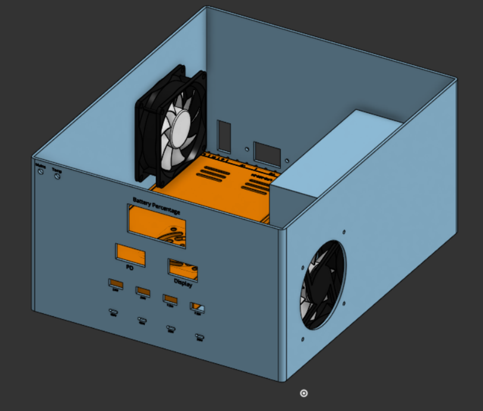
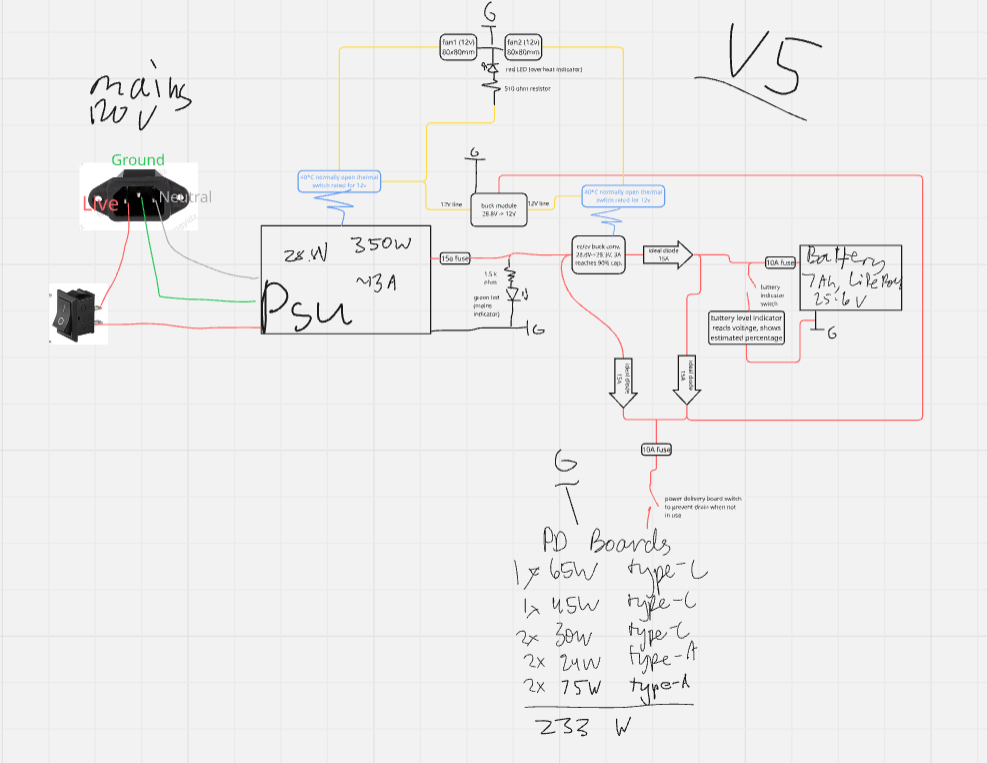

# MacroUPS

An uninterruptible power supply for high speed usb-c and usb-a charging.

### Specs

- 180 Wh LiFePO4 battery - charges an iPhone 16 13 times from 0% to 100%
- 250 watts usb output continuous
- 4 fast charge usb-c ports
- 4 usb-a ports (2 fast charge, 2 slow)
- instantaneous switchover time

### Motivation

In our house, we currently charge all our devices in one place, and there aren't enough power outlets. This UPS also acts as backup power in case of an outage, so we can still charge our devices for long after the power is out.

## Parts List

### Power

- 1x of `14awg Wire 30ft`, TYPE 15ft 14awg: [link](https://www.amazon.com/gp/product/B0D969PF5C/) – PRICE $9.98
- 1x of `Power Supply Cable 3-Prong 1.2m`, TYPE USA: [link](https://www.aliexpress.com/item/3256807060355465.html) – PRICE $3.49
- 1x of `IEC320 C14/C13 Panel Socket`, TYPE Type 4: [link](https://www.aliexpress.com/item/3256808473935736.html) – PRICE $1.33
- 1x of `24V 7Ah LiFePO4 Rechargeable Battery with BMS`, TYPE 24V / 7Ah: [link](https://www.amazon.com/gp/product/B0DSRT3BB8/) – PRICE $42.99
- 1x of `MEAN WELL LRS-350-24`, TYPE N/A: [link](https://www.amazon.com/gp/product/B013ETVO12/) – PRICE $28.54

### Power Delivery

- 1x of `PD65W fast charging module (Type-C)`, TYPE 4pcs: [link](https://www.aliexpress.com/item/3256806830457021.html) – PRICE $4.19
- 1x of `PD45W fast charging module (Type-C)`, TYPE 45W: [link](https://www.aliexpress.com/item/3256807318962557.html) – PRICE $1.99
- 2x of `PD30W fast charging module (Type-C)`, TYPE 30W: [link](https://www.aliexpress.com/item/3256807318962557.html) – PRICE $1.95
- 1x of `USB-A breakout female board`, TYPE 5PCS: [link](https://www.aliexpress.com/item/3256807147268432.html) – PRICE $1.24
- 1x of `USB-A QC2.0/3.0 buck converter module`, TYPE 2 Channel: [link](https://www.aliexpress.com/item/3256809395236306.html) – PRICE $1.99
- 4x of `120W USB-C to USB-C fast charging cable`, TYPE Black C-C/2m: [link](https://www.aliexpress.com/item/3256807024111085.html) – PRICE $2.79
- 4x of `120W USB-C to USB-A fast charging cable`, TYPE Black A-C/2m: [link](https://www.aliexpress.com/item/3256807024111085.html) – PRICE $2.21

### Modules

- 1x of `DC-DC adjustable buck converter XL4015`, TYPE HW-083B 4pcs: [link](https://www.aliexpress.com/item/3256806491709950.html) – PRICE $5.07
- 1x of `Battery capacity indicator voltmeter`, TYPE Color Screen/CHINA: [link](https://www.aliexpress.com/item/3256804198482360.html) – PRICE $4.46

#### The Custom Ideal Diode Module (5x) - Order Total (for 5x): $29.12

Check the [ideal diode folder](https://github.com/22yeets22/MacroUPS/tree/main/Ideal%20Diode) for specific BOM, gerber, pickandplace, as well as source files + images.

> [!IMPORTANT]
> There are two versions. The first version is much smaller and does not come with screw blocks. The second version is larger, but comes with screw blocks for easier mounting. Choose the one that fits your needs best.

Motivation:

- Almost all cheap ideal diode modules commonly found on AliExpress use the XL74610. However, it has voltage drops every half-second because it is groundless and must recharge its capacitor. This is bad for my application, since it would cause voltage fluctuations and constant switching between battery and mains.
- Handles **30a** with big heatsinks on both sides and maybe a thicker copper pour or copper wires on VIN and VOUT)
- Voltage range is up to **40V** limited by the MOSFET.
- 125 C max operating temperature (by components minimum temp), but please keep it cooler than that.

##### V1

| Schematic                                           | PCB                                     | 3D View                               |
| --------------------------------------------------- | --------------------------------------- | ------------------------------------- |
|  |  |  |

##### V2

| Schematic                                           | PCB                                     | 3D View                               |
| --------------------------------------------------- | --------------------------------------- | ------------------------------------- |
|  |  |  |

### Switches + Fuses

- 1x of `Rocker switch ON-OFF`, TYPE Red 2Pin: [link](https://www.aliexpress.com/item/2255800661582532.html) – PRICE $0.76
- 2x of `SPST waterproof toggle switch`, TYPE N/A: [link](https://www.aliexpress.com/item/3256808459598008.html) – PRICE $2.89
- 2x of `Circuit breaker switch fuse`, TYPE 10A/Other: [link](https://www.aliexpress.com/item/3256805757815979.html) – PRICE $1.63
- 1x of `Circuit breaker switch fuse`, TYPE 15A/Other: [link](https://www.aliexpress.com/item/3256805757815979.html) – PRICE $1.89

### Cooling

- 2x of `12V DC cooling fan`, TYPE 8025/12V: [link](https://www.aliexpress.com/item/3256806120222119.html) – PRICE $3.59
- 3x of `Thermal switch temperature sensor 40C/H`, TYPE 40C/H (Normally Open): [link](https://www.aliexpress.com/item/2251832786193672.html) – PRICE $1.33
- 1x of `Aluminum heatsink 15x15x15mm`, TYPE 15x15x15mm: [link](https://www.aliexpress.com/item/3256803892794950.html) – PRICE $4.38
- 1x of `Aluminum heatsink 8.8x8.8x5mm`, TYPE 8.8x8.8x5mm: [link](https://www.aliexpress.us/item/2251832663311102.html) – PRICE $2.29

## Wiring Diagram

