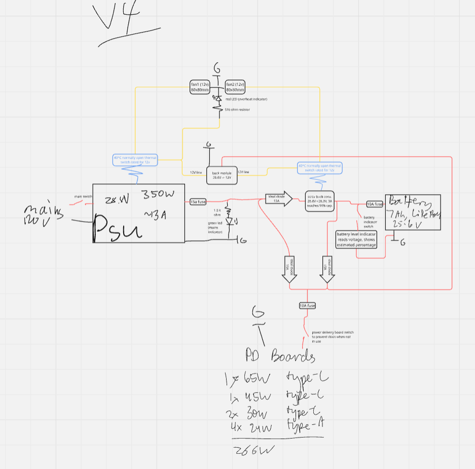

# MacroUPS
An uninterruptible power supply for high speed usb-c and usb-a charging.

## Parts List
### Power
- 1x of `14awg Wire 30ft`, TYPE 15ft 14awg: [link](https://www.amazon.com/gp/product/B0D969PF5C/) – PRICE $9.98
- 1x of `US Power Cord 3 Prong 18AWG 6ft`, TYPE N/A: [link](https://www.amazon.com/gp/product/B0829Q8DL9/) – PRICE $8.99
- 1x of `24V 7Ah LiFePO4 Rechargeable Battery with BMS`, TYPE 24V / 7Ah: [link](https://www.amazon.com/gp/product/B0DSRT3BB8/) – PRICE $42.99
- 1x of `MEAN WELL LRS-350-24`, TYPE N/A: [link](https://www.amazon.com/gp/product/B013ETVO12/) – PRICE $28.54

### Power Delivery
- 1x of `PD65W fast charging module (Type-C)`, TYPE 4pcs: [link](https://www.aliexpress.com/item/3256806830457021.html) – PRICE $4.19
- 1x of `PD45W fast charging module (Type-C)`, TYPE 45W: [link](https://www.aliexpress.com/item/3256807318962557.html) – PRICE $1.99
- 2x of `PD30W fast charging module (Type-C)`, TYPE 30W: [link](https://www.aliexpress.com/item/3256807318962557.html) – PRICE $1.95
- 1x of `USB-A breakout female board`, TYPE 5PCS: [link](https://www.aliexpress.com/item/3256807147268432.html) – PRICE $1.24
- 1x of `USB-A QC2.0/3.0 buck converter module`, TYPE 2 Channel: [link](https://www.aliexpress.com/item/3256809395236306.html) – PRICE $1.99
- 4x of `120W USB-C to USB-C fast charging cable`, TYPE Black C-C/2m: [link](https://www.aliexpress.com/item/3256807024111085.html) – PRICE $2.79
- 4x of `120W USB-C to USB-A fast charging cable`, TYPE Black A-C/2m: [link](https://www.aliexpress.com/item/3256807024111085.html) – PRICE $2.21

### Modules
- 1x of `DC-DC adjustable buck converter XL4015`, TYPE HW-083B 4pcs: [link](https://www.aliexpress.com/item/3256806491709950.html) – PRICE $5.07
- 1x of `Battery capacity indicator voltmeter`, TYPE Color Screen/CHINA: [link](https://www.aliexpress.com/item/3256804198482360.html) – PRICE $4.46

#### The Custom Ideal Diode Module (3x)
Check the [ideal diode folder](https://github.com/22yeets22/MacroUPS/tree/main/Ideal%20Diode) for specific BOM, gerber, pickandplace, as well as source files + images.
| Schematic | PCB | 3D View |
|-----------|-----|---------|
|  |  |  |
**Order Total:** $29.12

### Switches + Fuses
- 1x of `Rocker switch ON-OFF`, TYPE Red 2Pin: [link](https://www.aliexpress.com/item/2255800661582532.html) – PRICE $0.76
- 2x of `SPST waterproof toggle switch`, TYPE N/A: [link](https://www.aliexpress.com/item/3256808459598008.html) – PRICE $2.89
- 2x of `Circuit breaker switch fuse`, TYPE 10A/Other: [link](https://www.aliexpress.com/item/3256805757815979.html) – PRICE $1.63
- 1x of `Circuit breaker switch fuse`, TYPE 15A/Other: [link](https://www.aliexpress.com/item/3256805757815979.html) – PRICE $1.89

### Cooling
- 2x of `12V DC cooling fan`, TYPE 8025/12V: [link](https://www.aliexpress.com/item/3256806120222119.html) – PRICE $3.59
- 3x of `Thermal switch temperature sensor 40C/H`, TYPE 40C/H (Normally Open): [link](https://www.aliexpress.com/item/2251832786193672.html) – PRICE $1.33
- 1x of `Aluminum heatsink 15x15x15mm`, TYPE 15x15x15mm: [link](https://www.aliexpress.com/item/3256803892794950.html) – PRICE $4.38
- 1x of `Aluminum heatsink 8.8x8.8x5mm`, TYPE 8.8x8.8x5mm: [link](https://www.aliexpress.com/item/3256803892794950.html) – PRICE $2.29

## Wiring Diagram

